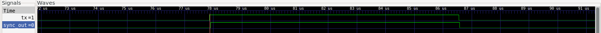

# UART TX/RX Core with Clock-Domain-Crossing Synchronization

A UART transmitter/receiver with TX and RX running on independent clocks (50 MHz and 48 MHz), connected through a 2-flip-flop CDC synchronizer. A UART line has no clock of its own, so whoever's sampling it is always crossing a clock domain — this project treats that as a real design constraint instead of ignoring it, which is what most basic UART examples do by putting TX and RX on the same clock.

## Architecture

```
clk_tx domain                    clk_rx domain
+-----------+     tx_serial     +------------+     +-----------+
| baud_gen  |------------------>| cdc_sync   |---->| uart_rx   |
| uart_tx   |                   | (2FF, line)|     | baud_gen  |
+-----------+                   +------------+     +-----------+
      ^                                                   |
      |              rx_valid (status flag)               |
      +---------------- cdc_sync (2FF) <-------------------+
```

- **`baud_gen.v`** — 16x-oversample baud tick generator, one instance per clock domain
- **`uart_tx.v`** — TX FSM: IDLE → START → DATA(8) → STOP
- **`uart_rx.v`** — RX FSM: confirms the start bit mid-way through (rejects glitches), samples data bits at bit-center, checks the stop bit and flags frame errors
- **`cdc_sync.v`** — generic parameterized 2-flip-flop synchronizer, used for both the serial line and the status flag
- **`uart_top.v`** — wires everything together across the two clock domains
- **`uart_tb.v`** — self-checking testbench, directed + randomized bytes

## Known limitation

`rx_valid` is synchronized with a plain 2FF synchronizer, which works here because the pulse is wide relative to the destination clock period. If the destination clock were fast enough relative to the source, a plain 2FF sync could drop a single-cycle pulse entirely. The proper fix is a toggle-and-detect scheme (toggle the flag instead of pulsing it, then detect the toggle edge after synchronizing), or an async FIFO for anything wider than a single bit.

## How to run

```bash
# Simulate
iverilog -g2012 -o sim baud_gen.v uart_tx.v uart_rx.v cdc_sync.v uart_top.v uart_tb.v
vvp sim

# View waveform
gtkwave uart_tb.vcd

# Optional: check it's synthesizable (generic cell mapping)
yosys -p "read_verilog baud_gen.v uart_tx.v uart_rx.v cdc_sync.v uart_top.v; synth -top uart_top; stat"
```

## Test results

```
[82430000] PASS: byte 0x00 received correctly
[168557000] PASS: byte 0xff received correctly
[255227000] PASS: byte 0x55 received correctly
[341355000] PASS: byte 0xaa received correctly
[428024000] PASS: byte 0x01 received correctly
[514152000] PASS: byte 0x80 received correctly
[600821000] PASS: byte 0x24 received correctly
[686949000] PASS: byte 0x81 received correctly
[773619000] PASS: byte 0x09 received correctly
[859746000] PASS: byte 0x63 received correctly
[946416000] PASS: byte 0x0d received correctly

ALL 11 TESTS PASSED
```

## Waveform



`tx` and its synchronized version `sync_out` — the delay between the two edges is the 2FF synchronizer resolving the signal into the RX clock domain.
